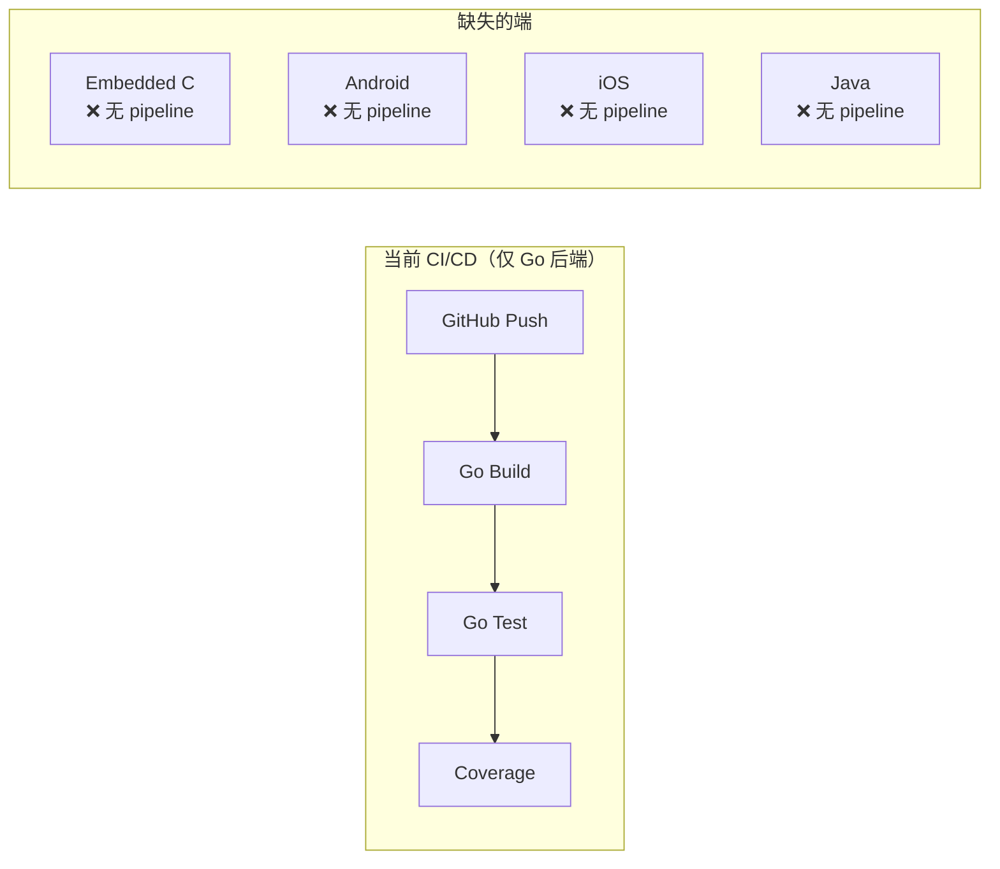

# yuleDKCS Architecture Assessment

> 评估时间: 2026-07-07
> 评估范围: 基于 README.md + SYSTEM_ARCHITECTURE.md + PRD.md + DEV-TASKS.md + safety-concept.md
> 评估方法: 架构文档审查 + 项目结构分析（非逐行代码审查）

---

## 1. 架构与 Spec 的追溯性评估

### 1.1 PRD → 架构映射分析

| PRD Epic | 架构文档覆盖 | 追溯性 | 评估 |
|----------|-------------|--------|------|
| Epic 1: 基础解锁体验 | 3.2 手机端架构 + 3.3 车端架构 + 4.2 解锁流程 | ✅ 完全覆盖 | 3 条核心用户故事 (US1.1-1.4) 均有对应架构实现 |
| Epic 2: 钥匙分享与授权 | 云端 3.3.2 分享服务 + 权限服务 | ✅ 完全覆盖 | 但架构文档中未描述分享的**离线/异步场景**（部分网络差时分享怎么处理） |
| Epic 3: 远程控制 | 4.3 远程控车流程 + 7.1 部署架构 | ✅ 覆盖 | gRPC+MQTT 双通道设计合理，但缺少**故障转移机制**（MQTT 断连时的降级策略） |
| Epic 4: 安全与合规 | 5.1 密钥层级 + 5.2 加密算法 + safety-concept.md | ✅ 完全覆盖 | 安全架构设计深度足够。但**国密 SM2/SM3/SM4 集成位置**未在架构文档中明确 |
| Epic 5: 第三方集成 | 8.1 新增适配器 + 7.0 后台管理系统 | ⚠️ 部分覆盖 | 第三方 SDK 的 API 文档存在 (API_REFERENCE.md)，但**鉴权模型** (OAuth2 scopes) 未在架构文档中展开 |

### 1.2 需求追溯性缺口

| 缺口 | 严重度 | 说明 |
|------|--------|------|
| **非功能需求追溯** | 🟡 中 | PRD 6.1-6.5 的非功能需求（性能/可用性/安全/兼容性/可扩展）在架构文档中没有对应的架构决策记录 |
| **安全场景追溯** | 🟡 中 | FSC 中的 Safety Goal SG-01~SG-06 在架构文档中没有明确的架构元素标注 |
| **离线模式架构** | 🟢 低 | US1.3 (NFC 紧急解锁) 的实现架构未在 SYSTEM_ARCHITECTURE.md 中详细描述 |

### 1.3 建议

- 创建 **需求 ↔️ 架构 ↔️ 测试用例追溯矩阵**（建议使用 Bitable 或 Enterprise Architect）
- 在架构文档中每个核心模块增加 **«satisfies» SG-XX** 标记
- PRD 中的离线场景需补充架构设计文档

---

## 2. 各端架构合理性

### 2.1 嵌入式端（C 语言三协议栈）

#### 优势 ✅

| 特性 | 评价 |
|------|------|
| **协议栈分层** | `[Application] → [Protocol Stack] → [HAL] → [Drivers]` 四层结构清晰，各层职责明确 |
| **统一 HAL 层** | BLE/UWB/NFC/SE 四个 HAL 抽象，硬件替换只需改驱动层不影响协议栈 |
| **SE050 集成** | 密钥从不出 SE、所有加密运算在 SE 内完成，设计符合 EAL5+ |
| **三协议并行** | ICCE/CCC/ICCOA 独立目录，互不干扰，通过协议路由器选择 |

#### 风险 🟡

| 风险项 | 等级 | 理由 |
|--------|------|------|
| **无 ASIL-B 运行时框架** | 🔴 高 | 现有 C 代码是裸机/RTOS 模式，未运行在 yuleASR OSEK OS 上。ASIL-B 要求的**时间隔离、内存隔离、看门狗管理**均未实现 |
| **无统一错误处理规范** | 🟡 中 | 三协议栈可能有不同的错误码风格，集成后错误传递可能混乱 |
| **内存安全** | 🟡 中 | C 语言协议栈的缓冲区处理在复杂场景下易引入内存安全漏洞 |
| **无静态分析基线** | 🟡 中 | 当前无 MISRA 规则集约束代码质量 |

#### 建议

1. **短期**: 对三协议栈统一错误码体系，确保错误可传播到上层应用和诊断模块
2. **中期**: 增加**内存安全沙箱**或使用 **MISRA C:2023 安全子集**约束代码（禁止动态内存分配、限制指针使用）
3. **长期**: 规划 yuleASR OSEK OS 上的 ASIL-B 分区运行（SE 密钥操作为 ASIL-B，BLE 通信为 QM）

### 2.2 Android SDK (Kotlin)

#### 优势 ✅

| 特性 | 评价 |
|------|------|
| **四层架构** | API / Communication / Security / Infrastructure 分层清晰 |
| **BerTLV 编解码** | 独立模块，适配 CCC/ICCE 的 TLV 数据格式 |
| **安全存储** | 明确使用 Android Keystore + TEE/StrongBox |
| **MVVM Demo App** | Android-app 使用现代架构，提供了完整的参考实现 |

#### 风险 🟡

| 风险项 | 等级 | 理由 |
|--------|------|------|
| **SDK 版本兼容性** | 🟡 中 | 目标 API 29+ (Android 10) 需要验证各品牌厂商的 UWB API 差异（Pixel vs 小米 vs OPPO） |
| **Flutter 桥接层** | 🟢 低 | DEV-TASKS.md 中提到的 Flutter + Riverpod 架构与当前 README 中的原生 Kotlin/Swift 策略不一致，需确认最终决策 |
| **UWB 后台运行** | 🟡 中 | iOS 和 Android 的 UWB 后台限制不同，影响无感解锁体验 |

### 2.3 iOS SDK (Swift)

#### 优势 ✅

| 特性 | 评价 |
|------|------|
| **Apple 原生框架** | Wise 选择 CoreBluetooth + CoreNFC + NearbyInteraction，最大化系统兼容性 |
| **Keychain 封装** | 正确使用 Secure Enclave 安全存储 |

#### 风险 🟡

| 风险项 | 等级 | 理由 |
|--------|------|------|
| **Apple CarKey 生态壁垒** | 🔴 高 | Apple CarKey (CCC) 的 app-clip/wallet 集成需要 Apple MFI 认证和审批，现有 SDK 是否支持 wallet-based key 需确认 |
| **Background UWB** | 🟡 中 | iOS NearbyInteraction 前台前台限制严格，后台测距需要变通方案（BLE 辅助唤醒） |
| **XCTest 覆盖** | 🟢 低 | 测试文件路径 `frontend/ios-tests/` 存在，但需确认实质测试内容 |

### 2.4 云端架构 (Go + Java)

#### 优势 ✅

| 特性 | 评价 |
|------|------|
| **Hub ↔ DKCS ↔ Adapters 三层** | 分工清晰：Hub 做 API Gateway 和协议路由，DKCS 做核心业务，Adapters 做厂商适配 |
| **Go 服务** | gRPC 双向流高性能，适合钥匙服务和车控指令场景 |
| **Java 适配器框架** | AbstractTspAdapter + AdapterRegistry 设计扩展性良好，新增厂商只需一个 module |
| **多部署模式** | `all-in-one` / `hub-only` / `server-only` 三种模式，灵活适配不同部署场景 |

#### 风险 🟡

| 风险项 | 等级 | 理由 |
|--------|------|------|
| **Java Adapters ↔ Hub 通信** | 🟡 中 | Adapters 通过 gRPC 与 Hub 通信，但**gRPC 连接中断后的重试/退避策略**未见描述 |
| **分布式一致性** | 🟡 中 | 钥匙状态在 DKCS + Hub + Vehicle 三者之间的一致性模型未明确（最终一致？强一致？） |
| **TPS 承诺** | 🟡 中 | PRD 承诺 100,000 TPS，但**无性能基准数据**，当前架构也未描述水平扩展的具体机制 |
| **HSM 集成** | 🟢 低 | KMS 依赖 HSM，但 HSM 选型（Thales Luna? Cloud HSM?）和集成接口未在架构文档中说明 |

---

## 3. 安全架构集成度

### 3.1 安全架构总体评估

| 维度 | 评分 | 说明 |
|------|------|------|
| 安全概念完整性 | ⭐⭐⭐⭐⭐ | HARA + FSC 完整，ASIL 分解合理，6 个 SG 清晰 |
| 密钥层级设计 | ⭐⭐⭐⭐⭐ | 4 级密钥体系 (Root→Master→Device→Session) 设计优秀 |
| 防中继机制 | ⭐⭐⭐⭐ | UWB ToF + Nonce + 时间窗口 + 多因子，(无 BLE RSSI 特征指纹) |
| 安全启动链 | ⭐⭐⭐ | Boot ROM → BootLoader → TFM → App 设计正确，但缺少故障注入保护 |
| ASIL-B 落地 | ⭐⭐ | Safety Goal 定义完成，但**安全机制未在代码中实现**（需要 yuleASR BSW） |
| 国密合规 | ⭐⭐ | 架构支持但**SM2/SM3/SM4 代码尚未完整集成** |
| 渗透测试 | ⭐⭐⭐ | TEST-PLAN 中有中继攻击测试设计，但**未执行** |

### 3.2 关键安全缺口

| 缺口 | 严重度 | 影响 |
|------|--------|------|
| **ASIL-B 运行时无实现** | 🔴 高 | SG-01~SG-06 的 FSC 映射停留在概念层，没有实际的 yuleASR BSW 集成代码 |
| **国密算法未完工** | 🔴 高 | ICCE 认证的硬性要求，当前 protocol 框架到位但 SM2/SM3/SM4 未完整集成 |
| **FSC→代码追溯缺失** | 🟡 中 | 无法证明 SG-03 (防中继) 的 FTTI <100ms 已实现 |
| **App 端 root/越狱检测** | 🟡 中 | PRD 提到需要运行环境检测，但架构和测试计划中未详细描述 |

### 3.3 建议

1. **创建安全架构实现矩阵**: 将 FSC 中的 6 个 Safety Goal 映射到具体的代码模块、接口和测试用例
2. **优先完成国密**: ICCE 认证的最短路径是先让 SM2/SM3/SM4 代码在 ICCE 协议栈中跑通
3. **增加 ASIL 标注**: 在每个关键函数和数据结构上标注 `/* ASIL-B */`，明确安全等级

---

## 4. 与 yuleASR BSW 的集成方案建议

### 4.1 当前状态

| BSW 组件 | 状态 | 建议集成优先级 |
|----------|------|--------------|
| MCAL (S32G2/G3) | ❌ 待集成 | P0 — 板级启动的前提 |
| OS (OSEK AUTOSAR OS) | ❌ 待集成 | P0 — ASIL-B 调度的前提 |
| EcuM (ECU 状态管理) | ❌ 待集成 | P0 — 系统状态机 |
| COM (Signal→I-PDU 映射) | ❌ 待集成 | P1 — CAN 通信 |
| DCM (UDS 诊断) | ❌ 待集成 | P1 — 产线诊断 |
| DEM (DTC 管理) | ❌ 待集成 | P1 — 故障诊断 |
| NvM (NVRAM 管理) | ❌ 待集成 | P1 — 钥匙数据持久化 |
| WdgM (看门狗管理) | ❌ 待集成 | P1 — ASIL-B 监控 |
| CSM (Crypto Service Manager) | ❌ 待集成 | P1 — 标准化密码接口 |
| CanIf (CAN 接口) | ❌ 待集成 | P2 — CAN 通信 |

### 4.2 建议的集成策略

**三阶段方案**:

```
Phase 1 (Week 8-10): BSW 基础设施
  └─ MCAL + OS + EcuM + NvM ── 让系统在 yuleASR 上可启动、可调度
  └─ 现有 C 协议栈作为单个 OS Task 运行（QM 等级）

Phase 2 (Week 10-14): 诊断与通信
  └─ DCM + DEM + COM ── 支持 UDS 诊断和 CAN 通信
  └─ CSM ── 替换现有的直接 SE050 调用为标准化 Crypto API

Phase 3 (Week 14-20): ASIL-B 分区
  └─ WdgM ── 为 ASIL-B 路径增加看门狗
  └─ 将 SE 操作分离到 ASIL-B 分区，BLE 操作留在 QM 分区
  └─ TMS (Timing Monitoring) ── 确保 SG-01~SG-03 的 FTTI
```

### 4.3 集成架构草图

```
┌────────────────────────────────────────────────────┐
│                yuleASR OSEK OS                      │
├──────────────────┬────────────────┬─────────────────┤
│   ASIL-B Partition  │   QM Partition   │  SWC 层    │
│  ┌──────────────┐  │ ┌────────────┐  │               │
│  │ SE Crypto    │  │ │ BLE Stack  │  │  (未来 SWC   │
│  │ Key Mgmt     │  │ │ UWB Stack  │  │   化方向)    │
│  │ Anti-Relay   │  │ │ NFC Stack  │  │               │
│  │ FTTI Monitor │  │ │ Protocol   │  │               │
│  └──────────────┘  │ │ Router     │  │               │
│                    │ └────────────┘  │               │
├──────────────────┴────────────────┴─────────────────┤
│              yuleASR BSW Services                    │
│  CSM │ NvM │ DCM │ DEM │ COM │ WdgM │ EcuM         │
├──────────────────────────────────────────────────────┤
│              yuleASR MCAL                            │
│  CanIf │ LinIf │ SPI │ I2C │ UART                   │
└──────────────────────────────────────────────────────┘
```

---

## 5. CI/CD 架构设计方案

### 5.1 当前 CI/CD 状态



### 5.2 建议的 CI/CD 架构

```
┌─────────────────────────────────────────────────────────────────────┐
│                   yuleOSH Pipeline Orchestrator                      │
├─────────────────────────────────────────────────────────────────────┤
│                                                                      │
│  ┌──────────────┐  ┌──────────────┐  ┌──────────────┐              │
│  │   Trigger    │  │   Quality    │  │   Artifacts  │              │
│  │  Push/PR/Tag │─▶│  Gates       │─▶│  Build+Store │              │
│  └──────────────┘  └──────────────┘  └──────────────┘              │
│         │                 │                   │                     │
│         ▼                 ▼                   ▼                     │
│  ┌──────────────────────────────────────────────────────────┐      │
│  │                   Parallel Pipeline Matrix                 │      │
│  ┌───────────┐ ┌───────────┐ ┌──────────┐ ┌────────┐ ┌──────┤      │
│  │ Embedded  │ │ Android   │ │ iOS      │ │ Go     │ │ Java  │      │
│  │ (C/CMake) │ │ (Kotlin)  │ │ (Swift)  │ │ (Hub/  │ │ (Mvn) │      │
│  │           │ │           │ │          │ │  DKCS) │ │       │      │
│  ├───────────┤ ├───────────┤ ├──────────┤ ├────────┤ ├───────┤      │
│  │①Lint:     │ │①Detekt    │ │①SwiftLint│ │①golang│ │①Check │      │
│  │ cppcheck  │ │②Lint      │ │②Build    │ │  ci-  │ │ style │      │
│  │ MISRA     │ │③Build     │ │③Test     │ │  lint │ │②Build │      │
│  │②Build:c   │ │④Test      │ │④Coverage │ │②Build │ │③Test  │      │
│  │  make     │ │⑤Coverage  │ │⑤Pack     │ │③Test  │ │④Covrg │      │
│  │③Test:     │ │⑥Pack      │ │  .xcw    │ │④Covrg │ │⑤Pack  │      │
│  │  ctest    │ │  .aar     │ │          │ │⑤Bin   │ │ .jar  │      │
│  │④Coverage │ │           │ │          │ │       │ │       │      │
│  │⑤HEX/Bin  │ │           │ │          │ │       │ │       │      │
│  └───────────┘ └───────────┘ └──────────┘ └────────┘ └───────┘      │
└─────────────────────────────────────────────────────────────────────┘
```

### 5.3 关键设计决策

| 决策 | 选项 | 建议 | 理由 |
|------|------|------|------|
| **Pipeline 语言** | GitHub Actions / Jenkins / yuleOSH DSL | **yuleOSH DSL** | 与 yuleOH 生态系统一致，统一编排 |
| **Build 环境** | 单 Docker 镜像 / 多镜像 / 分离 Runner | **多镜像** | 每端 toolchain 不同，避免镜像膨胀 |
| **并行策略** | 串行 / 全并行 / 矩阵并行 | **矩阵并行** | 五端相互独立，可并行构建 |
| **嵌入式模拟器** | QEMU S32G2 / 软仿真 / 仅编译 | **编译+单元测试为主** | S32G2 QEMU 复杂，先保证交叉编译和单元测试通过 |
| **移动端 CI** | Docker runner / macOS runner | **macOS runner (iOS)** / **Docker (Android)** | iOS 必须在 macOS 上构建 |
| **覆盖率聚合** | 独立报告 / 统一报告 | **独立报告 + 看板聚合** | 各端工具链不同（gcov/JaCoCo/XCTest），独立采集后统一展示 |

### 5.4 推荐的 Pipeline YAML 结构

```yaml
# yuleOSH pipeline.yaml (概念设计)
pipeline:
  name: yuleDKCS Full CI
  trigger: [push, pull_request]
  
  stages:
    - name: static_analysis
      parallel:
        - embedded: { tool: cppcheck, rule: misra_c_2023 }
        - android:   { tool: detekt, config: config/detekt.yml }
        - ios:       { tool: swiftlint, config: .swiftlint.yml }
        - go:        { tool: golangci-lint, config: .golangci.yml }
        - java:      { tool: checkstyle, config: config/checkstyle.xml }
    
    - name: build
      parallel:
        - embedded: { tool: cmake, target: arm-none-eabi }
        - android:  { tool: gradle, task: assembleRelease }
        - ios:      { tool: xcodegen, then: xcodebuild }
        - go:       { tool: go, subcmd: build ./... }
        - java:     { tool: mvn, phase: package }
    
    - name: unit_test
      parallel:
        - embedded: { tool: ctest, filter: unit }
        - android:  { tool: gradle, task: testDebugUnitTest }
        - ios:      { tool: xcodebuild, action: test }
        - go:       { tool: go, subcmd: test -cover }
        - java:     { tool: mvn, phase: test }
    
    - name: coverage_gate
      threshold: { embedded: 80, android: 70, ios: 70, go: 75, java: 70 }
    
    - name: artifact_publish
      when: [tag: v*]
      artifacts:
        - embedded/firmware.hex → releases/
        - frontend/android/build/outputs/aar/*.aar → maven/
        - frontend/ios/build/DigitalKeySDK.xcframework → cocoapods/
        - backend/cloud/hub/hub-server → docker/hub:latest
        - backend/adapters/adapter-core/target/*.jar → maven/
```

---

## 6. 关键架构风险项

### 🔴 高风险（立即需要关注）

| # | 风险 | 描述 | 影响 | 缓解措施 |
|---|------|------|------|---------|
| R1 | **ICCE 国密算法未完整实现** | SM2/SM3/SM4 仅框架就绪，核心算法库未集成 | 阻塞 ICCE 认证 | Week 2 内确定国密库（商密库 / GmSSL / 独立实现） |
| R2 | **ASIL-B 安全机制零落地** | 6 个 Safety Goal 全部停留在概念设计 | 无法满足功能安全审计 | 制定 ASIL-B 分区计划，先在 QM 等级验证协议栈功能正确性 |
| R3 | **嵌入式交叉编译环境缺失** | 无法验证 ARM 编译是否通过 | 所有嵌入式 pipeline 阻塞 | Week 1 配置并验证 |
| R4 | **五端 CI/CD 零覆盖** | 仅有 Go 后端 CI，其他四端无流水线 | 无质量门禁，无自动化回归 | Week 1-5 分批建设，先核心后外围 |
| R5 | **端到端集成测试环境缺失** | 各端独立测试，从未进行过三端联调 | 跨端协议兼容性风险未知 | Week 3-5 搭建 E2E 环境 |

### 🟡 中风险（需规划）

| # | 风险 | 描述 | 缓解措施 |
|---|------|------|---------|
| R6 | **MISRA C:2023 合规度未知** | 现有 24K+ C 代码未经 MISRA 扫描 | 运行 cppcheck MISRA，按违规数量评估整改工作量 |
| R7 | **Android/iOS SDK 版本兼容性** | 未验证各品牌和系统版本的 UWB/BLE 行为差异 | 建立真机测试矩阵，覆盖 Top 10 机型 |
| R8 | **HSM 集成未定型** | 云端 KMS 依赖 HSM 但选型和接口未定 | 先使用 Mock HSM 验证流程，后期替换实时 HSM |
| R9 | **分布式钥匙一致性模型** | 钥匙状态在云-车-手机三者间的一致性未明确 | 定义一致性策略（最终一致 + 冲突检测） |
| R10 | **性能基准缺失** | 云端 TPS 承诺 100k 但无任何压力测试数据 | Week 1 搭建 k6 基准测试，建立基线 |

### 🟢 低风险（观察即可）

| # | 风险 | 描述 |
|---|------|------|
| R11 | Apple CarKey 生态壁垒 | Apple Wallet 集成需要 MFI 认证，但不影响 SDK 本身功能 |
| R12 | Flutter vs 原生分歧 | DEV-TASKS 提了 Flutter，实际用原生，需要确认最终决策 |
| R13 | 部署模式复杂性 | 三种部署模式 (all-in-one/hub-only/server-only) 增加测试面 |
| R14 | OTA 通道依赖 | 车厂 OTA 平台能力影响钥匙配对时效，但非 SDK 可控风险 |

---

## 7. 总体架构评分

| 维度 | 评分 (1-5) | 说明 |
|------|-----------|------|
| **架构完整性** | 4.5 / 5 | 三端架构定义清晰，分层合理 |
| **需求追溯性** | 3.0 / 5 | PRD→架构充分，但缺正式追溯矩阵 |
| **安全架构** | 3.5 / 5 | 安全概念优秀，但 ASIL-B 落地空缺 |
| **扩展性** | 4.5 / 5 | Java Adapter 框架和协议路由器设计良好 |
| **CI/CD 就绪度** | 1.5 / 5 | 仅 Go 后端有 CI，其他四端零覆盖 |
| **测试就绪度** | 3.5 / 5 | 测试计划完整，但 0 条用例执行过 |
| **BSW 集成度** | 1.0 / 5 | 无任何 yuleASR BSW 集成 |
| **总评分** | **3.1 / 5** | 代码成熟度高，工程流程和 BSW 集成是最大短板 |

---

## 8. 一页纸行动清单

| # | 行动项 | 优先级 | 端 | 目标日期 |
|---|--------|--------|----|---------|
| 1 | 安装验证嵌入式交叉编译工具链 | P0 | Embedded | Week 1 |
| 2 | 运行 Go 后端全量 pipeline (lint+build+test+coverage) | P0 | Go | Week 1 |
| 3 | 确定 ICCE 国密算法库并验证集成 | P0 | Embedded | Week 2 |
| 4 | 配置嵌入式 MISRA C:2023 门禁 (cppcheck) | P0 | Embedded | Week 3 |
| 5 | 搭建 E2E 集成测试环境 | P0 | All | Week 4 |
| 6 | 建 Android detekt + JaCoCo 门禁 | P1 | App | Week 4 |
| 7 | 建 iOS SwiftLint + XCTest coverage 门禁 | P1 | App | Week 4 |
| 8 | 建 Java Checkstyle + JaCoCo 门禁 | P1 | Java | Week 5 |
| 9 | 制定 yuleASR BSW 三阶段集成计划 | P1 | Embedded | Week 8 |
| 10 | 执行防中继模拟攻击验证 | P1 | Embedded+App | Week 6 |
| 11 | 构建需求→架构→测试追溯矩阵 | P2 | All | Week 8 |
| 12 | 运行五端压力测试与性能基线 | P2 | All | Week 10 |
| 13 | 产出 ASPICE L2 合规证据包 | P2 | All | Week 12 |
| 14 | Apple Wallet / 第三方集成 | P3 | App | Week 12+ |

---

*本文档为架构级快速评估，基于文档审查，未涉及逐行代码分析。建议在 Phase 1 执行后进行代码级 deep dive。*
