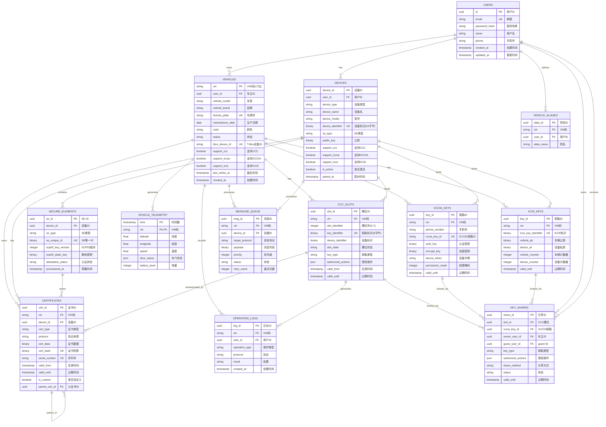
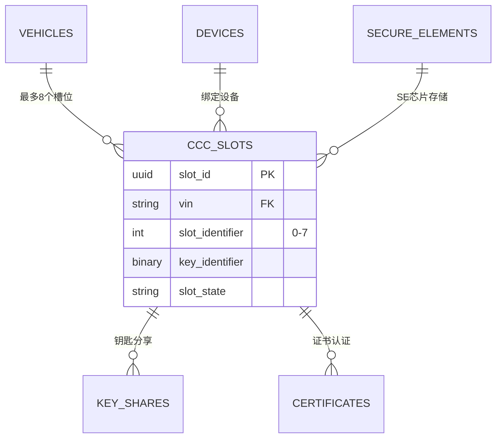
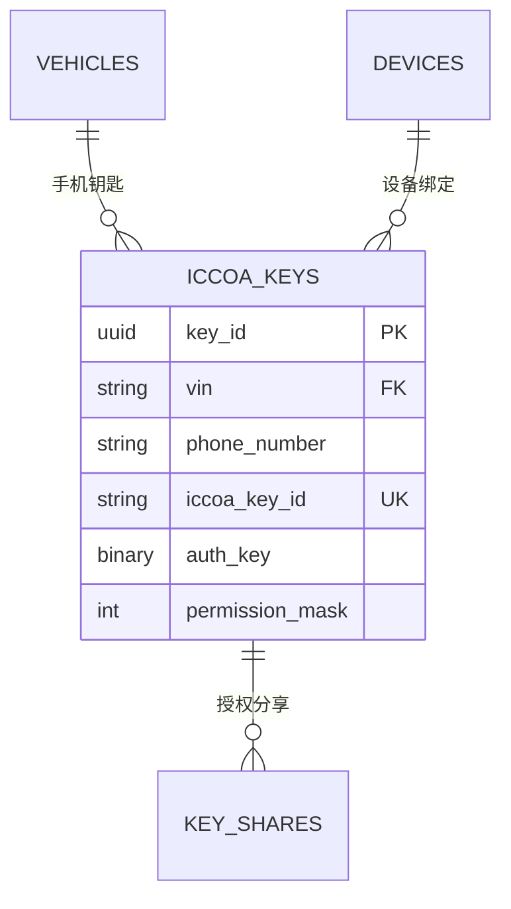
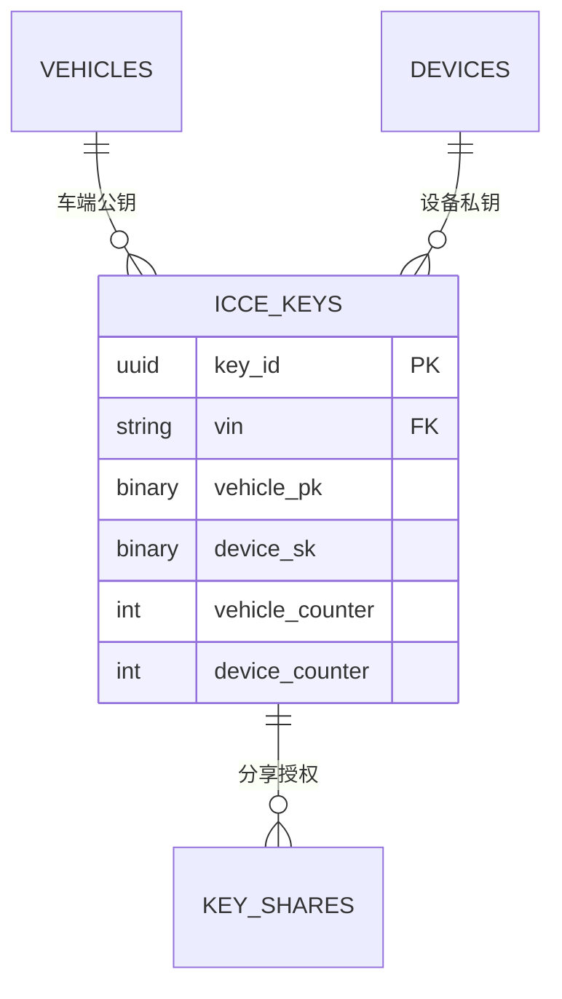
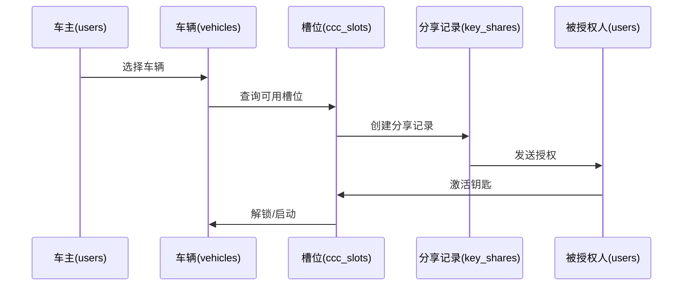
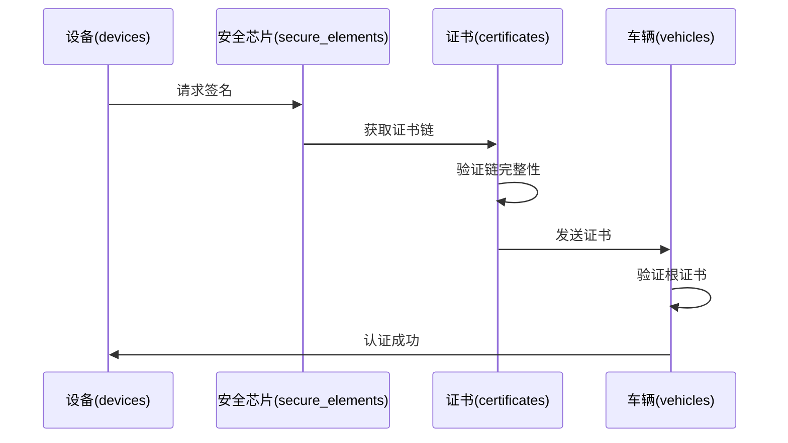

# yuleDKCS 车云一体化数据库 ER 图

> **版本**: v1.0.0  
> **数据库**: PostgreSQL 15+  
> **支持协议**: CCC / ICCOA / ICCE

---

## 一、完整 ER 图



---

## 二、核心关系说明

### 2.1 用户-车辆关系

```
users ||--o{ vehicles : owns
```
- 一个用户可以拥有多辆车
- 每辆车有唯一VIN作为主键
- 车辆支持多种数字钥匙协议

### 2.2 车辆-钥匙关系

```
vehicles ||--o{ ccc_slots : has
vehicles ||--o{ iccoa_keys : has
vehicles ||--o{ icce_keys : has
```
- 一辆车可同时拥有CCC/ICCOA/ICCE钥匙
- CCC: 最多8个槽位(slot 0-7)
- ICCOA/ICCE: 理论上无限，实际受限于策略

### 2.3 设备-钥匙绑定

```
devices ||--o{ ccc_slots : binds
devices ||--o{ iccoa_keys : binds
devices ||--o{ icce_keys : binds
```
- 一个设备可绑定多把钥匙(不同车辆)
- 通过 device_identifier 关联

### 2.4 证书链关系

```
certificates ||--o{ certificates : parent_of
```
- 自引用关系构建证书链
- parent_cert_id 指向父证书

---

## 三、协议特定关系

### 3.1 CCC 关系图



### 3.2 ICCOA 关系图



### 3.3 ICCE 关系图



---

## 四、数据流关系

### 4.1 钥匙分享流程



### 4.2 证书验证流程



---

## 五、表统计信息

| 表名 | 类型 | 主键 | 外键数 | 说明 |
|------|------|------|--------|------|
| users | 核心 | uuid | 0 | 用户基础 |
| vehicles | 核心 | varchar(17) | 1 | 车辆信息 |
| devices | 核心 | uuid | 1 | 设备管理 |
| ccc_slots | 协议 | uuid | 2 | CCC槽位 |
| iccoa_keys | 协议 | uuid | 1 | ICCOA钥匙 |
| icce_keys | 协议 | uuid | 1 | ICCE钥匙 |
| certificates | 安全 | uuid | 4 | 证书存储 |
| key_shares | 业务 | uuid | 4 | 分享记录 |
| operation_logs | 审计 | uuid | 2 | 操作日志 |
| vehicle_telemetry | 时序 | time+vin | 1 | 遥测数据 |

---

## 六、索引策略

### 6.1 主键索引
所有表均使用主键索引

### 6.2 唯一索引
- vehicles: vin, license_plate, tbox_device_id
- devices: device_identifier
- ccc_slots: key_identifier
- certificates: cert_hash, serial_number

### 6.3 外键索引
- 所有 _id 结尾的外键字段均有索引
- 复合索引支持多条件查询

### 6.4 查询优化索引
```sql
-- 车辆查询优化
CREATE INDEX idx_vehicles_user_status ON vehicles(user_id, status);

-- 槽位查询优化
CREATE INDEX idx_ccc_slots_vin_state ON ccc_slots(vin, slot_state);

-- 日志查询优化
CREATE INDEX idx_logs_vin_time ON operation_logs(vin, created_at DESC);
```

---

*文档版本: v1.0.0*  
*生成时间: 2026-05-11*
