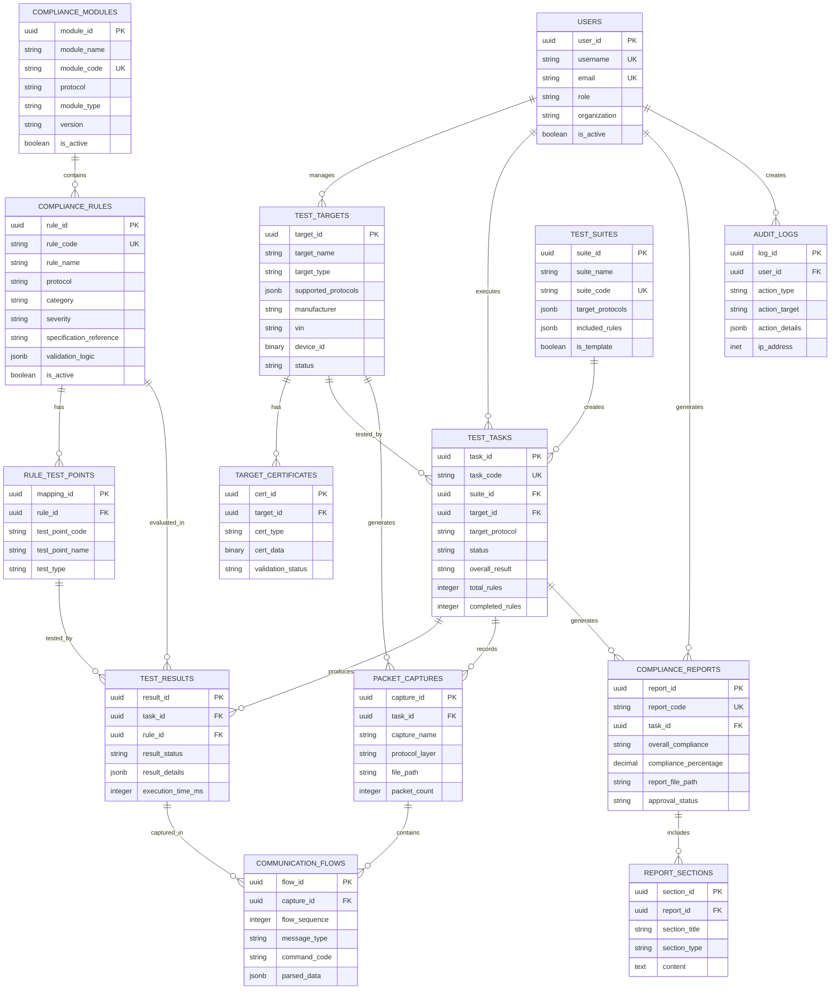
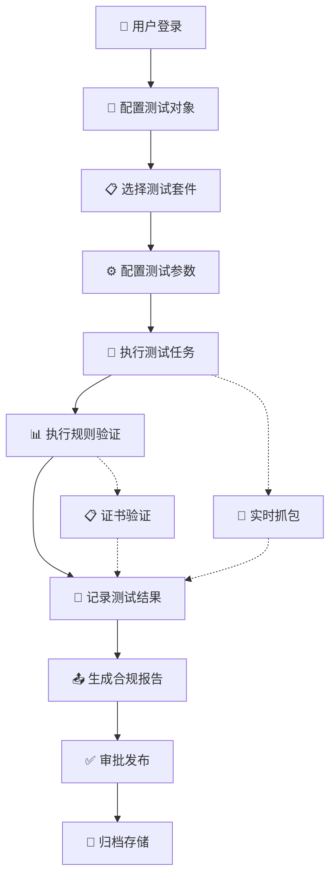
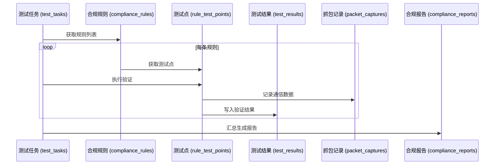

# yuleDKCS 数据库 ER 图

> **项目名称**: yuleDKCS (Digital Key Compliance System)  
> **版本**: v1.0.0  
> **用途**: 数字钥匙合规性检测系统  
> **支持协议**: CCC / ICCOA / ICCE

---

## 一、核心实体关系图



---

## 二、核心业务流程

### 2.1 合规测试完整流程



### 2.2 规则验证数据流



---

## 三、核心表说明

### 3.1 合规规则体系 (核心)

| 表名 | 用途 | 关键字段 |
|------|------|----------|
| **compliance_modules** | 合规模块 | protocol, module_type, version |
| **compliance_rules** | 合规规则 | rule_code, category, severity, validation_logic |
| **rule_test_points** | 规则测试点 | test_type, execution_script |

**规则分类 (category)**:
- `cryptography` - 加密算法合规
- `protocol` - 通信协议合规
- `security` - 安全机制合规
- `performance` - 性能指标合规
- `interoperability` - 互操作性合规
- `certificate` - 证书验证
- `key_management` - 密钥管理合规

**强制性等级 (severity)**:
- `mandatory` - 强制要求 (不通过即不合规)
- `recommended` - 推荐要求 (警告不影响合规判定)
- `optional` - 可选要求 (参考性)

### 3.2 测试执行流程

| 表名 | 用途 | 关键字段 |
|------|------|----------|
| **test_targets** | 测试对象 (DUT) | target_type, supported_protocols, vin, device_id |
| **target_certificates** | 证书管理 | cert_type, cert_data, validation_status |
| **test_suites** | 测试套件 | target_protocols, included_rules |
| **test_tasks** | 测试任务实例 | status, overall_result, progress |

### 3.3 测试结果与报告

| 表名 | 用途 | 关键字段 |
|------|------|----------|
| **test_results** | 测试结果 | result_status, result_details, evidence_files |
| **packet_captures** | 抓包数据 | protocol_layer, file_path, packet_count |
| **communication_flows** | 通信流水线 | message_type, parsed_data |
| **compliance_reports** | 合规报告 | overall_compliance, compliance_percentage |
| **report_sections** | 报告章节 | section_type, content |

---

## 四、关键关系说明

### 4.1 规则-测试-结果关系

```
compliance_rules (1) ──▶ (N) rule_test_points
      │
      │ (1:N)
      ▼
test_results (N) ◀─────────── (1) test_tasks
```

- 一条规则包含多个测试点
- 一个测试任务执行多条规则
- 每条规则执行产生一个结果

### 4.2 对象-任务-报告关系

```
test_targets (1) ──▶ (N) test_tasks
                     │
                     │ (1:1)
                     ▼
              compliance_reports
                     │
                     │ (1:N)
                     ▼
              report_sections
```

- 一个测试对象可执行多个测试任务
- 一个测试任务生成一份报告
- 一份报告包含多个章节

### 4.3 抓包-通信流关系

```
packet_captures (1) ──▶ (N) communication_flows
```

- 一次抓包会话包含多条通信记录
- 每条记录对应协议栈的一个消息

---

## 五、协议支持映射

| 数据库表 | CCC支持 | ICCOA支持 | ICCE支持 |
|----------|----------|-----------|----------|
| compliance_rules | ✅ 完整 | ✅ 完整 | ✅ 完整 |
| test_targets | ✅ 支持 | ✅ 支持 | ✅ 支持 |
| target_certificates | ✅ 必需 | ◯ 可选 | ◯ 可选 |
| packet_captures | ✅ BLE+NFC+UWB | ✅ BLE | ✅ BLE |
| communication_flows | ✅ 完整 | ✅ 完整 | ✅ 完整 |

---

## 六、数据库统计

| 类别 | 表数量 | 说明 |
|------|--------|------|
| 系统管理 | 3 | 用户/配置/模块 |
| 合规规则 | 3 | 规则/测试点/套件 |
| 测试执行 | 4 | 对象/证书/任务/结果 |
| 数据采集 | 2 | 抓包/通信流 |
| 报告生成 | 2 | 报告/章节 |
| 审计日志 | 1 | 操作日志 |
| **合计** | **15** | |

---

*文档版本: v1.0.0*  
*生成时间: 2026-05-11*
