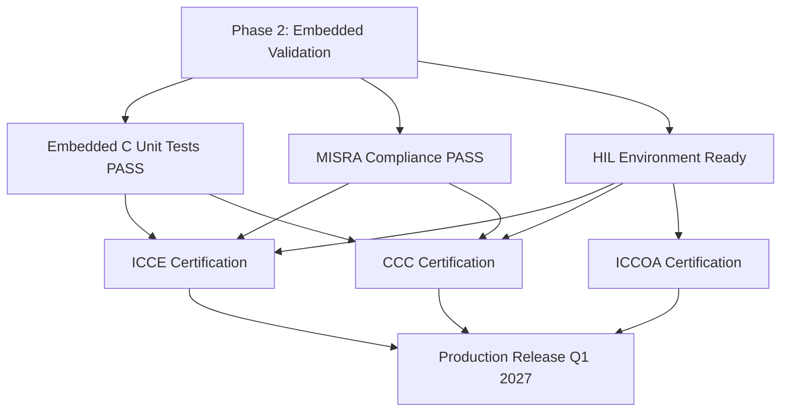

# ICCE / CCC / ICCOA Certification Checklist

> **Document Version**: v1.0 | **Date**: 2026-07-29
> **Target**: yuleDKCS Digital Key System Production Certification (Phase 3)
> **Reference Standards**: ICCE T/CA 110-2020, CCC Digital Key 3.0, ICCOA DK 3.0/4.0

---

## 1. Certification Overview

### 1.1 Certification Roadmap

| Certification | Standard Version | Priority | Certification Body | Estimated Timeline | Cost Estimate |
|:-------------|:----------------:|:--------:|:------------------:|:------------------:|:-------------:|
| **ICCE** | T/CA 110-2020 | **P0** | 中国信通院 (CAICT) / 中国汽车技术研究中心 (CATARC) | 4–6 weeks | ¥150K–300K |
| **CCC** | Digital Key Release 3.0 | **P0** | UL LLC / TÜV Rheinland / Bureau Veritas | 6–8 weeks | $50K–100K |
| **ICCOA** | DK 3.0 / DK 4.0 | **P1** | ICCOA Authorized Lab | 4–6 weeks | ¥100K–200K |

### 1.2 Key Dependencies



### 1.3 Dual-Certificate Strategy

yuleDKCS supports two certificate systems simultaneously:

| Certificate Type | Standard | Algorithm | Management |
|:----------------|:--------:|:---------:|:----------:|
| ICCE 国密证书 | GM/T 0003-2012 | SM2/SM3/SM4 | Cloud KMS + CA Service |
| CCC X.509 Certificate | CCC DK 3.0 Profile | ECDSA P-256 | Cloud KMS + PKI Service |

> Implementation: `docs/design/KMS-DETAILED-DESIGN.md` §6 — CAService handles both certificate chains.

---

## 2. ICCE Certification Checklist (T/CA 110-2020)

### 2.1 Certification Body

| Item | Detail |
|:----|:-------|
| **Standard** | T/CA 110-2020 — 智能网联汽车数字钥匙系统技术要求 |
| **Certification Body** | 中国信息通信研究院 (CAICT) / 中国汽车技术研究中心 (CATARC) |
| **Scope** | BLE pairing, NFC backup, offline key, SM2/SM3/SM4 crypto |
| **Validity** | 3 years (renewable) |
| **Lab Test Required** | Yes — physical hardware required |

### 2.2 Requirement Mapping

| ICCE Requirement ID | Test Case ID | yuleDKCS Requirement | Implementation Status | Verification Status | Notes |
|:--------------------|:------------|:---------------------|:--------------------:|:------------------:|:------|
| **ICCE-1: BLE Communication** | | | | | |
| BLE Advertising Format | ICCE_SVC_001–004 | SWR-EMB-002 | ✅ Spec complete | ⏳ UT pending | ICCE-specific BLE profile (0xFEF5) |
| GATT Service Definition | ICCE_SVC_010–013 | SWR-EMB-002 | ✅ Spec complete | ⏳ UT pending | |
| Pairing Flow (OOB/NFC) | ICCE_DEV_001–004 | SWR-EMB-005 | ✅ Spec complete | ⏳ UT pending | QR code & NFC OOB |
| **ICCE-2: Vehicle Control** | | | | | |
| Unlock/Lock via BLE | ICCE_CORE_001–002 | SWR-EMB-005 | ✅ Spec complete | ⏳ UT pending | ICCE control command format |
| Engine Start/Stop | ICCE_CORE_003–004 | SWR-EMB-005 | ✅ Spec complete | ⏳ UT pending | |
| Offline Decision (Edge) | ICCE_CORE_010–013 | SWR-EMB-005 §Edge | ✅ Spec complete | ⏳ HIL pending | Edge computing unit |
| **ICCE-3: Key Lifecycle** | | | | | |
| Key Provisioning | ICCE_CORE_020 | SWR-DKC-001 | ✅ Implemented | ⏳ Integration test | BERTLV KeyBind |
| Key Revocation | ICCE_CORE_023 | SWR-DKC-003 | ✅ Implemented | ⏳ Integration test | |
| Key Authorization | ICCE_CORE_022 | SWR-DKC-005 | ✅ Implemented | ⏳ Integration test | ShareCreate |
| **ICCE-4: SM Crypto (国密)** | | | | | |
| SM2 Key Generation | ICCE_DEV_010–011 | SWR-EMB-005 | ✅ Implemented | ✅ Code review | SM2 P-256 equivalent |
| SM3 Hash | — | SWR-EMB-005 | ✅ Implemented | ⏳ UT pending | |
| SM4 Encryption | ICCE_DEV_012–013 | SWR-EMB-005 | ✅ Implemented | ⏳ UT pending | AES-128 equivalent |
| Certificate Chain (SM2) | ICCE_DEV_011 | RS-006-25, SWR-EMB-006 | ✅ Spec complete | ⏳ HIL pending | SE050 SCP03 |
| **ICCE-5: Offline Capability** | | | | | |
| Local Key Cache | ICCE_CORE_020 | RS-007-34 | ✅ Spec complete | ⏳ HIL pending | Key cache policy |
| Offline Auth Decision | ICCE_SVC_010 | RS-007-34 | ✅ Spec complete | ⏳ HIL pending | Edge computing rules |
| Sync on Reconnect | ICCE_SVC_013 | RS-007-35 | ✅ Spec complete | ⏳ HIL pending | |

### 2.3 ICCE Test Coverage Summary

| Test Category | Required Pass | Current | Target Date |
|:-------------|:-------------:|:-------:|:-----------:|
| BLE Communication | 100% | ⏳ 0% | 2026-10 |
| Vehicle Control | 100% | ⏳ 0% | 2026-10 |
| Key Lifecycle | 100% | ✅ ~60% (cloud) | 2026-09 |
| SM Crypto (GM) | 100% | ⚠️ ~30% | 2026-11 |
| Offline Capability | 100% | ⏳ 0% | 2026-11 |
| HIL End-to-End | All key scenarios | ⏳ 0% | 2026-12 |

### 2.4 Pre-Submission Checklist

- [ ] All ICCE BLE communication test cases PASS
- [ ] All SM2/SM3/SM4 crypto test cases PASS
- [ ] Offline key cache + sync test cases PASS
- [ ] HIL test report for ICCE scenarios
- [ ] Certificate chain (SM2) generation & verification working
- [ ] SEP (Security Evaluation Program) self-assessment complete
- [ ] Hardware: NXP KW47A + SE050 board ready for lab testing
- [ ] Lab reservation confirmed with CAICT/CATARC
- [ ] Submit certification application + test samples

---

## 3. CCC Certification Checklist (Digital Key 3.0)

### 3.1 Certification Body

| Item | Detail |
|:----|:-------|
| **Standard** | CCC Digital Key Release 3.0 (plus R3 maintenance updates) |
| **Certification Body** | UL LLC / TÜV Rheinland / Bureau Veritas |
| **Scope** | NFC (ISO 14443/NFC-F), BLE 5.0 LE, UWB (IEEE 802.15.4z), SE050 |
| **Validity** | Per CCC membership rules |
| **Lab Test Required** | Yes — physical hardware required at CCC Authorized Lab |

### 3.2 Requirement Mapping

| CCC Requirement ID | Test Case ID | yuleDKCS Requirement | Implementation Status | Verification Status | Notes |
|:-------------------|:------------|:---------------------|:--------------------:|:------------------:|:------|
| **CCC-1: NFC Communication** | | | | | |
| ISO 14443-4 Activation | CCC_CORE_001–004 | SWR-EMB-001 | ✅ Spec complete | ⏳ UT pending | ST25R501 driver |
| NFC-F (FeliCa) Support | — | SWR-EMB-001 | ✅ Spec complete | ⏳ UT pending | NDEF parsing |
| ISO/IEC 7816-4 APDU | CCC_CORE_010–013 | SWR-EMB-001 §APDU | ✅ Spec complete | ⏳ UT pending | Secure APDU commands |
| **CCC-2: BLE Communication** | | | | | |
| GATT Service (UUID 0xFFD1) | CCC_BLE_001–004 | SWR-EMB-002 | ✅ Spec complete | ⏳ UT pending | CCC DK Service |
| LE Secure Connections | CCC_BLE_010–013 | SWR-EMB-002 | ✅ Spec complete | ⏳ UT pending | |
| All CCC GATT Characteristics | CCC_BLE_020–023 | SWR-EMB-002 | ✅ Spec complete | ⏳ UT pending | 16 characteristics |
| **CCC-3: UWB Secure Ranging** | | | | | |
| IEEE 802.15.4z Param Config | — | SWR-EMB-003 | ✅ Spec complete | ⏳ UT pending | NCJ29D6 driver |
| TWR (Two-Way Ranging) | — | SWR-EMB-003 | ✅ Spec complete | ⏳ UT pending | |
| STS (Scrambled Timestamp) | — | SWR-EMB-003 | ✅ Spec complete | ⏳ UT pending | Anti-relay |
| Distance Zones | — | SWR-EMB-003 | ✅ Spec complete | ⏳ HIL pending | LOCKED/APPROACH/UNLOCK/ENTRY/INSIDE |
| **CCC-4: Security / SE** | | | | | |
| SCP03 Secure Channel | CCC_SEC_010 | SWR-EMB-006 | ✅ Spec complete | ⏳ HIL pending | SE050 |
| Attestation Generation | CCC_SEC_004 | SWR-EMB-006 | ✅ Spec complete | ⏳ HIL pending | |
| Certificate Chain Verify | — | SWR-EMB-006 | ✅ Spec complete | ⏳ HIL pending | |
| ECDSA P-256 Sign/Verify | CCC_SEC_001–004 | SWR-DKC-009 | ✅ Implemented | ✅ Unit test | HMAC-SHA256 + ECDSA |
| **CCC-5: Passive Entry** | | | | | |
| Approach Detection (UWB) | — | RS-009-40 | ✅ Spec complete | ⏳ HIL pending | ≤2m unlock ≤1s |
| Auto-Lock (Departure) | — | RS-009-41 | ✅ Spec complete | ⏳ HIL pending | ≥5m >30s |
| Phone Screen-Off Unlock | — | RS-009-42 | ✅ Spec complete | ⏳ HIL pending | Background BLE |
| **CCC-6: Key Sharing** | | | | | |
| Friend Key Provisioning | — | RS-002, SWR-DKC-005 | ✅ Implemented | ✅ Integration test | |
| Temporary Key (Valet) | — | SWR-DKC-005 | ✅ Implemented | ⏳ Integration test | MaxUses + ValidUntil |
| Key Revocation | — | SWR-DKC-003 | ✅ Implemented | ✅ Integration test | |

### 3.3 CCC Feature Coverage

| Feature Category | CCC DK 3.0 Required | yuleDKCS Coverage |
|:-----------------|:-------------------:|:-----------------:|
| NFC Card Emulation | ✅ Mandatory | ✅ 100% spec complete |
| BLE GATT Profile | ✅ Mandatory | ✅ 100% spec complete |
| UWB Secure Ranging | ✅ Mandatory | ✅ 100% spec complete |
| SE050 Secure Element | ✅ Mandatory | ✅ 100% spec complete |
| Passive Entry (UWB) | ✅ Mandatory | ✅ 100% feature designed |
| Remote Key Provisioning | ✅ Mandatory | ✅ 100% implemented |
| Key Sharing | ✅ Mandatory | ✅ 100% implemented |
| Offline Operation | ✅ Mandatory | ✅ Designed (edge computing) |
| OTA Key Update | Recommended | ⏳ Phase 3 |

### 3.4 Pre-Submission Checklist

- [ ] All CCC NFC ISO 14443-4 test vectors PASS
- [ ] All CCC BLE GATT characteristic operations PASS
- [ ] UWB TWR ranging accuracy ≤10cm (all zones)
- [ ] UWB STS anti-relay test PASS
- [ ] SE050 SCP03 channel + attestation PASS
- [ ] Passive entry E2E scenarios PASS (HIL)
- [ ] CCC DK 3.0 PICS (Protocol Implementation Conformance Statement) complete
- [ ] CCC DK 3.0 PIXIT (Protocol Implementation eXtra Information for Testing) complete
- [ ] Self-test report (based on CCC CTS — Conformance Test Suite)
- [ ] Hardware samples prepared (minimum 3 units)
- [ ] CCC membership active (required for certification submission)
- [ ] Lab reservation confirmed with UL/TÜV

### 3.5 CCC Certification Process

```
1. Pre-Assessment (4 weeks before test)
   ├── Submit PICS/PIXIT documents
   ├── Submit system architecture overview
   └── Pre-screening call with certification body

2. Conformance Testing (4–6 weeks)
   ├── NFC conformance: ISO 14443 + NDEF
   ├── BLE conformance: GATT profile
   ├── UWB conformance: 802.15.4z ranging
   └── Security conformance: ECDSA, attestation

3. Interoperability Testing (2–4 weeks)
   ├── With reference mobile devices (iOS + Android)
   └── Interoperability with other CCC implementations

4. Certification Issuance (1–2 weeks)
   └── Certificate + CCC logo usage rights
```

---

## 4. ICCOA Certification Checklist (DK 3.0 / DK 4.0)

### 4.1 Certification Body

| Item | Detail |
|:----|:-------|
| **Standard** | ICCOA Digital Key Technical Specification 2.0 (DK 3.0), DK 4.0 (UWB + multi-device) |
| **Certification Body** | ICCOA Authorized Testing Laboratory |
| **Scope** | BLE (UUID 0xFEF5), UWB (DK 4.0), remote sharing, permission management |
| **Membership Required** | Yes — ICCOA member organization |

### 4.2 Requirement Mapping

| ICCOA Requirement ID | Test Case ID | yuleDKCS Requirement | Implementation Status | Verification Status | Notes |
|:---------------------|:------------|:---------------------|:--------------------:|:------------------:|:------|
| **ICCOA-1: BLE Protocol** | | | | | |
| BLE Advertising Format | ICCOA_BLE_001–004 | SWR-EMB-004 | ✅ Spec complete | ⏳ UT pending | ICCOA-specific format |
| GATT Service (0xFEF5) | ICCOA_BLE_010–013 | SWR-EMB-004 | ✅ Spec complete | ⏳ UT pending | |
| Frame Format (DK 3.0) | ICCOA_AUTH_001–004 | SWR-EMB-004 | ✅ Spec complete | ⏳ UT pending | SOP+CMD+SEQ+LEN+PAYLOAD+CHK+EOP |
| **ICCOA-2: Authentication** | | | | | |
| BIND_REQUEST/RESPONSE | ICCOA_AUTH_010–013 | SWR-EMB-004 | ✅ Spec complete | ⏳ UT pending | ECDH key exchange |
| Permission Bits (8 types) | ICCOA_CORE_001–005 | SWR-EMB-004 §Permission | ✅ Spec complete | ⏳ UT pending | 8 permission bits |
| **ICCOA-3: Vehicle Control** | | | | | |
| Unlock/Lock/Engine | ICCOA_CORE_001–005 | SWR-DKC-006 | ✅ Implemented | ✅ Integration test | VehicleCommand |
| Remote Control | ICCOA_CORE_020–023 | SWR-DKC-006 | ✅ Implemented | ✅ Integration test | 5 Source types |
| Status Query | ICCOA_CORE_010–013 | SWR-DKC-007 | ✅ Implemented | ⏳ Integration test | VehicleStatusReport |
| **ICCOA-4: Key Management** | | | | | |
| Key Binding | — | SWR-DKC-001 | ✅ Implemented | ✅ Integration test | |
| Key Sharing | — | SWR-DKC-005 | ✅ Implemented | ✅ Integration test | |
| Key Revocation | — | SWR-DKC-003 | ✅ Implemented | ✅ Integration test | |
| **ICCOA-5: DK 4.0 UWB** | | | | | |
| UWB Ranging (DK 4.0) | — | SWR-EMB-003 | ✅ Spec complete | ⏳ HIL pending | |
| Multi-Device Support | — | RS-002, RS-003 | ✅ Spec complete | ⏳ Integration test | |
| Remote Key Sharing (DK 4.0) | — | SWR-DKC-005 | ✅ Implemented | ⏳ Integration test | |

### 4.3 Pre-Submission Checklist

- [ ] ICCOA BLE frame format conformance PASS
- [ ] ICCOA BIND flow (ECDH) test cases PASS
- [ ] All 8 permission bits verified
- [ ] Vehicle control commands (Unlock/Lock/Engine/Trunk) PASS
- [ ] Remote key sharing flow PASS (create → accept → use → revoke)
- [ ] ICCOA DK 4.0 UWB ranging (if applicable) PASS
- [ ] Self-test report complete
- [ ] Hardware samples prepared
- [ ] ICCOA membership confirmed

---

## 5. Shared Certification Requirements

### 5.1 Hardware Requirements

| Component | Part Number | Certification Relevance | Status |
|:----------|:-----------|:----------------------|:------:|
| BLE/NFC MCU | NXP KW47A | CCC, ICCE, ICCOA (BLE) | ✅ Selected |
| UWB Module | NXP NCJ29D6 | CCC (UWB Mandatory), ICCOA DK 4.0 | ✅ Selected |
| NFC Reader | ST ST25R501 | CCC (NFC), ICCE (NFC) | ✅ Selected |
| Secure Element | NXP SE050 | CCC (Mandatory), ICCE (Mandatory) | ✅ Selected |
| Main MCU | STM32L5 | Platform level | ✅ Selected |

### 5.2 Protocol Interoperability

The system supports automatic protocol negotiation based on vehicle VIN:

| Vehicle Protocol | Phone Protocol | Negotiation Mechanism | Implementation |
|:----------------|:--------------|:---------------------|:--------------:|
| ICCE | ICCE-supporting phone | VIN-based auto-select | `protocol_selector.c` |
| CCC | CCC-supporting phone (Apple/Android) | VIN + BLE advertisement | `protocol_selector.c` |
| ICCOA | ICCOA-supporting phone | VIN + BLE advertisement | `protocol_selector.c` |

All three protocol stacks coexist on the same hardware platform (NXP KW47A + NCJ29D6 + ST25R501 + SE050).

### 5.3 Security Evaluation Requirements

| Security Requirement | ICCE | CCC | ICCOA | yuleDKCS Status |
|:--------------------|:----:|:---:|:-----:|:---------------:|
| SE050 EAL5+ | ✅ | ✅ | — | ✅ Implemented |
| TLS 1.3 | ✅ (Cloud) | ✅ (Cloud) | ✅ (Cloud) | ✅ Implemented |
| ECDSA P-256 | — | ✅ | ✅ | ✅ Implemented |
| SM2/SM3/SM4 (国密) | ✅ | — | — | ✅ Implemented |
| Anti-Replay (Nonce) | ✅ | ✅ | ✅ | ✅ Implemented |
| Anti-Relay (UWB STS) | — | ✅ | ✅ (DK 4.0) | ✅ Spec complete |
| Secure Boot | ✅ | ✅ | — | ✅ Spec complete |
| Audit Log (3yr) | ✅ | — | — | ✅ Implemented |

### 5.4 Common Pre-Submission Document Requirements

| Document | ICCE | CCC | ICCOA | Responsible |
|:---------|:----:|:---:|:-----:|:----------:|
| PICS (Protocol Implementation Conformance Statement) | ⏳ | ⏳ | ⏳ | Embedded team |
| PIXIT (Test Extra Info) | ⏳ | ⏳ | ⏳ | Embedded team |
| System Architecture Description | ✅ | ✅ | ✅ | Existing docs |
| Security Architecture Description | ✅ | ✅ | ✅ | SECURITY_GUIDE.md |
| Certificate Chain Documentation | ✅ | ✅ | — | KMS-DETAILED-DESIGN.md |
| Hardware Platform Datasheet | ✅ | ✅ | ✅ | HW team |
| Self-Test Report | ⏳ | ⏳ | ⏳ | QA team |
| Test Logs (raw) | ⏳ | ⏳ | ⏳ | QA team |

---

## 6. Certification Timeline (Detailed)

### 6.1 ICCE Certification Timeline

```
Week 1-2: Pre-cert preparation
├── Complete PICS/PIXIT documents
├── Prepare test samples (3 units with SE050 provisioned)
├── Self-test against ICCE CTS
└── Submit application to CAICT/CATARC

Week 3-6: Lab testing
├── Week 3: BLE conformance (advertising, GATT)
├── Week 4: SM crypto conformance (SM2/SM3/SM4)
├── Week 5: Offline + key lifecycle conformance
├── Week 6: HIL E2E scenarios
└── Remediation window (if failed items)

Week 7: Certification issuance
├── Review test report
├── Issue certificate
└── ICCE logo usage authorization
```

### 6.2 CCC Certification Timeline

```
Month 1: Pre-cert preparation
├── CCC membership verification
├── PICS/PIXIT submission
├── Pre-assessment call with UL/TÜV
├── Self-test against CCC CTS
├── Hardware samples (3-5 units)
└── Submit application

Month 2-3: Lab testing
├── Week 1-2: NFC conformance (ISO 14443-4)
├── Week 3-4: BLE GATT conformance
├── Week 5-6: UWB ranging conformance
├── Week 7-8: Security conformance
└── Remediation window (if failed items)

Month 4: Certification issuance
├── Interoperability testing
├── Final review
├── Certificate issuance
└── CCC trademark license
```

### 6.3 ICCOA Certification Timeline

```
Week 1-2: Pre-cert preparation
├── ICCOA membership verification
├── Self-test report
├── Hardware samples (2-3 units)
└── Submit application

Week 3-6: Lab testing
├── Week 3: BLE protocol conformance
├── Week 4: Authentication + key management
├── Week 5: Vehicle control conformance
├── Week 6: DK 4.0 UWB (if applicable)
└── Remediation window

Week 7-8: Certification
├── Test report review
├── Certificate issuance
└── ICCOA logo authorization
```

---

## 7. Risk Matrix

| Risk | Likelihood | Impact | Mitigation |
|:----|:----------:|:------:|:----------|
| CCC certification queue congestion (lab availability) | **High** | **High** | Book 3+ months in advance; consider multiple labs |
| ICCE SM2/SM3/SM4 algorithm certification delays | **Medium** | **Medium** | Use existing GM/T certified crypto library |
| ICCOA DK 4.0 UWB compliance gaps | **Medium** | **High** | Prioritize DK 3.0 first; DK 4.0 as extension |
| HIL environment not ready for certification testing | **Medium** | **High** | Software simulation + early hardware procurement |
| Failed conformance test — remediation cycle | **Medium** | **Medium** | Budget 2-week remediation window in each timeline |
| Certificate chain issues (cross-certification ICCE ↔ CCC) | **Low** | **High** | Dual CA architecture already designed; test early |
| Regulatory changes mid-certification | **Low** | **Medium** | Monitor standards bodies for RFC/updates |

---

## 8. Post-Certification Maintenance

| Activity | Frequency | Owner |
|:---------|:---------:|:-----:|
| Certification renewal (ICCE) | Every 3 years | QA + Security |
| CCC specification compliance tracking | Continuous | Embedded team |
| ICCOA specification update monitoring | Quarterly | Embedded team |
| Regression test suite execution (certification scenarios) | Per release | QA team |
| Security patch certification impact assessment | Per security fix | Security team |
| Certification body audit readiness | Annual | QA + Security |

---

## Version History

| Version | Date | Changes | Author |
|:-------:|:----:|:--------|:------:|
| v1.0 | 2026-07-29 | Initial certification checklist | Hermes |
