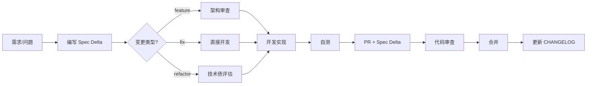

# 变更管理流程 (Change Process)

## 概述

本文档定义 yuleDKCS 项目的标准化变更管理流程。所有代码变更、Spec 更新和架构调整必须遵循本流程，确保变更可追溯、可验证、可审查。

## 流程图

## 核心规则

### 1. 变更必带 Spec Delta

任何代码变更（包括 bug fix）都必须附带 Spec Delta。Spec Delta 使用 `docs/spec-delta-template.md` 中的模板。

- **feature** — 必须填写完整字段，包括设计决策
- **fix** — 可简化变更描述，但不能省略
- **refactor** — 必须说明重构动机和预期收益

Spec Delta 文件放置方式（二选一）：

| 方式 | 说明 | 适用场景 |
|------|------|----------|
| PR 描述中内联 | 在 PR Description 中按模板填写 | 小型变更 |
| 独立文件 | 保存至 `docs/spec/deltas/YYYY-MM-DD-<brief>.md` | 大型 feature 或架构变更 |

### 2. Spec → 代码 → 测试 一致性

- Spec Delta 中声明的「受影响需求」必须在 `docs/requirement-traceability-matrix.md` 中有对应条目
- 每个「受影响需求」必须有对应的测试验证
- CHANGELOG 必须在合并前更新

### 3. CHANGELOG 管理

- `CHANGELOG.md` 统一采用 [Keep a Changelog](https://keepachangelog.com/) 格式
- 每个 PR 合入时，必须更新 CHANGELOG 的 `[Unreleased]` 章节
- 分类：`Added` / `Changed` / `Deprecated` / `Removed` / `Fixed` / `Security`

### 4. 需求追踪矩阵联动

`docs/requirement-traceability-matrix.md` 中的每个需求必须满足：

- 至少一个对应的 Spec Delta
- 至少一个对应的 Test Case
- 至少一个对应的 CHANGELOG 条目

## 角色与职责

| 角色 | 职责 |
|------|------|
| 变更发起人 | 编写 Spec Delta，确保与需求矩阵一致 |
| 代码审查员 | 验证 Spec Delta 与实际变更的一致性 |
| PM/架构师 | 审批 feature 级别的 Spec Delta |

## 例外

以下情况可免于撰写 Spec Delta：

- 纯文档修正（拼写、格式）
- CI/CD 配置变更（不涉及业务逻辑）
- 依赖版本升级（仅 patch 级别变更）

但仍需在 PR 描述中说明变更内容。

## 工具链

| 工具/检查 | 触发时机 |
|-----------|----------|
| PR 模板 | GitHub PR 打开时自动加载 |
| Spec Delta 检查 | CI 脚本检查 PR 是否包含 Spec Delta |
| CHANGELOG 检查 | CI 检查 `[Unreleased]` 章节是否更新 |
| 需求追踪检查 | 每周自动扫描需求矩阵覆盖率 |

---

*本文件随项目演进持续更新。*
