# yuleDKCS 改进计划 v3

> 基于完整性检查发现的遗留问题，分阶段逐步完善
> 文档版本: v1.0 | 2026-05-25

## 当前状态

| 指标 | 值 | 评级 |
|------|-----|------|
| 提交数 | **35 commits** | ✅ |
| 代码行数 | **~207K 行** | ✅ |
| 配置完整性 | **14/14** | ✅ |
| 工作区 | **清洁** | ✅ |
| 测试密度 | **5.2%** (含mbedtls) | ⚠️ |
| 文档站覆盖 | **~37%** | ⚠️ |
| Dockerfile构建 | `RUN go test`在builder中 | ❌ |

---

## 改进任务

### P1: Dockerfile 构建优化

**问题**: `backend/Dockerfile` 第28行在 builder 阶段运行 `RUN go test -v ./...`

**影响**: 
- 需要 DB/Redis 外部依赖的测试会失败，导致生产镜像构建失败
- 即使不需要外部依赖的测试，也会大幅增加构建时间

**方案**:
```dockerfile
# 移除 builder 阶段的测试
# 测试应在 CI 中独立执行

# 创建独立的 test stage (可选)
FROM builder AS test
RUN go test -race -cover ./internal/...  # 仅运行不依赖外部的测试
```

**文件**: `backend/Dockerfile`
**预估**: 5分钟

---

### P2: MkDocs 文档站补全

**问题**: `docs_site/` 有 37 个文档，但 `docs/` 目录有更多内容未被同步

**差距分析**:

| 类别 | docs/ 存在 | docs_site/ 已同步 | 缺失 |
|------|-----------|------------------|------|
| 协议规范 | 6 CSV + 3 MD | 部分 | ICCE/ICCOA对比表 |
| 设计文档 | design/ 多文件 | 部分 | gitignore_design, spi_hal_design |
| frontend 文档 | README + API.md | ❌ 未同步 | 前端API文档 |
| mobile 文档 | 3 个 README | ❌ 未同步 | iOS/Flutter集成文档 |
| 计划文档 | plans/ | ❌ 未同步 | 改进计划 |

**方案**: 更新 `mkdocs.yml` 添加缺失页面 + 手动同步关键文档
**文件**: `docs_site/mkdocs.yml`（如存在）
**预估**: 30分钟

---

### P3: 测试覆盖提升

**问题**: 整体测试密度 5.2%，但含 mbedtls 库代码

**实际应用代码测试**:

| 模块 | 测试情况 | 目标 |
|------|---------|------|
| `backend/internal/iccoa/cert/` | ✅ 24/24 PASS | 已达标 |
| `backend/internal/service/` | ⚠️ 部分测试，预存编译错误 | 修复编译 |
| `embedded/tests/unit/` | 13 测试文件 | 补充核心模块 |
| `frontend/` | 1 测试文件 | 补充组件测试 |

**方案**: 分批次补充，优先核心逻辑
**预估**: ~2小时

---

## 执行计划

```mermaid
gantt
    title yuleDKCS 改进时间线
    dateFormat  X
    axisFormat  %s
    
    section P1 构建优化
    Dockerfile 修复           :p1, 0, 1
    
    section P2 文档站
    比对差距                  :p2a, after p1, 1
    更新 mkdocs.yml          :p2b, after p2a, 1
    同步缺失文档              :p2c, after p2b, 2
    
    section P3 测试覆盖
    修复预存编译错误          :p3a, after p1, 1
    补充 ICCOA 模块测试       :p3b, after p3a, 2
    补充 key_tracking 测试    :p3c, after p3b, 2
```



---

## 约束

1. **文档先行** — 每个任务先出 API/设计文档
2. **测试不降级** — 修改后确保现有测试全部通过
3. **提交粒度** — 每个 P 一个 commit
